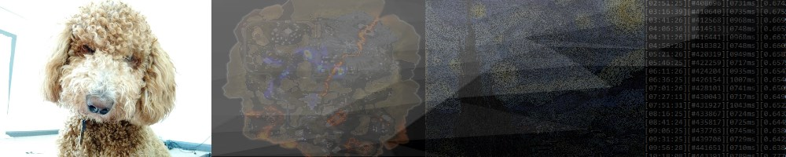

# Hi, I'm Bev

  

I'm a software engineer and undergraduate researcher interested in machine learning, computer vision, and full-stack development. I've worked professionally in software engineering and published peer-reviewed computer vision research.

A lot of my public work grew out of competitive gaming. I started by building tools to pull useful data out of gameplay footage, which eventually led into broader work with OCR, object tracking, pathfinding, temporal analysis, and applied machine learning.

Much of my recent work is private or closed-source, including real-time systems, computer vision research, full-stack applications, and ML experimentation. The repositories here represent a fun, but limited, subset of my work.

## Technologies and tools

- **Languages:** Python, TypeScript/JavaScript, C#, Java
- **Machine learning and computer vision:** PyTorch, OpenCV, YOLO, OCR, multi-object tracking
- **Web development:** React, Flask, Spring Boot
- **Infrastructure:** Linux, Docker, PostgreSQL

## Featured projects

1. **[Apex Analysis Toolset](https://github.com/happihound/Apex-Analysis-Toolset)** — A Python toolset that uses computer vision and OCR to extract statistics from Apex Legends footage.
2. **[Apex Rotation Advice](https://github.com/happihound/apex-rotation-advice)** — A pathfinding tool that computes fast, safer rotations between points of interest.
3. **[CV Sudoku Solver](https://github.com/happihound/CVsudokuSolver)** — A computer vision project that reads a Sudoku puzzle from an image, solves it, and renders the result.
4. **[Breaking Turtle Graphics](https://github.com/happihound/breakingTurtleGraphics)** — An experiment that converts images into instructions that Python's Turtle Graphics can draw.

## Contact

- [Twitter](https://twitter.com/happihound)
- Discord: `happihound`
